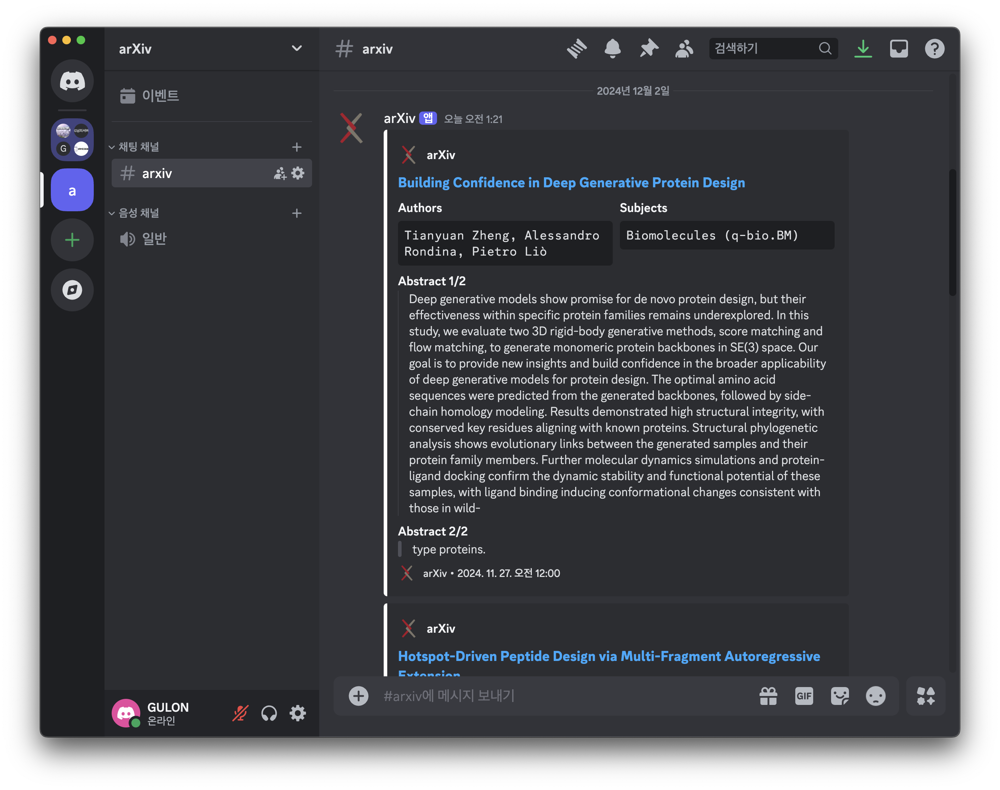

# Simple Arxiv Notify
**SimpleArxivNotify** is a tool to receive notifications about the latest papers on [arXiv](https://arxiv.org) directly through a Discord webhook. It sends the latest paper notifications (within the past day) and saves the corresponding PDF files.

  

**Features:**
- Receive daily notifications about new papers on arXiv to discord.
- Support for multiple subjects (e.g., cs, q-bio).
- Saves PDFs of the latest papers to a specified directory.

## Installation

### 1. Clone the repository:
    git clone git@github.com:Buddha7771/SimpleArxivNotify.git
    cd SimpleArxivNotify

### 2. Install required pakages:
It's recommended to create a dedicated conda environment for this project.

    pip install discord
    pip install beautifulsoup4

### 3. Generate a Discord Webhook URL:

To generate a Discord webhook URL, please follow this [article](https://support.discord.com/hc/en-us/articles/228383668-Intro-to-Webhooks).
Once you've created your webhook, the URL will look something like this: 

    https://discord.com/api/webhooks/000000000000000/XXXXXXXXXXXXXXXXXXXXX

## Usages

### Basic Usage:
To run the script and receive notifications for specific subjects, use like the following command:

    python run.py --webhook YOUR_WEBHOOK_URL --subjects SUBJECTS --dir /path/to/save/pdfs

### Command-line Flags:
| Flag | Description | 
|--|--|
| -w, --webhook | Discord webhook URL to send notifications. |
| -s, --subjects | Space-separated list of subjects to get notified about. (E.g. `cs`, `q-bio`) |
| -d, --dir | Directory to save the downloaded PDFs. |

## Setting up Daily Alerts
To set up a daily alarm to notify you about the latest papers, follow these steps:

### 1. Edit your crontab:

    crontab -e

### 2. Add a new line for the daily notification:

    # Add the following line to the crontab file
    0 07 * * * python /path/to/directory/run.py --webhook YOUR_WEBHOOK_URL --subjects SUBJECTS --dir /path/to/save/pdfs

This cron job will trigger the script every day at 7:00 AM and send notifications via your specified Discord webhook.